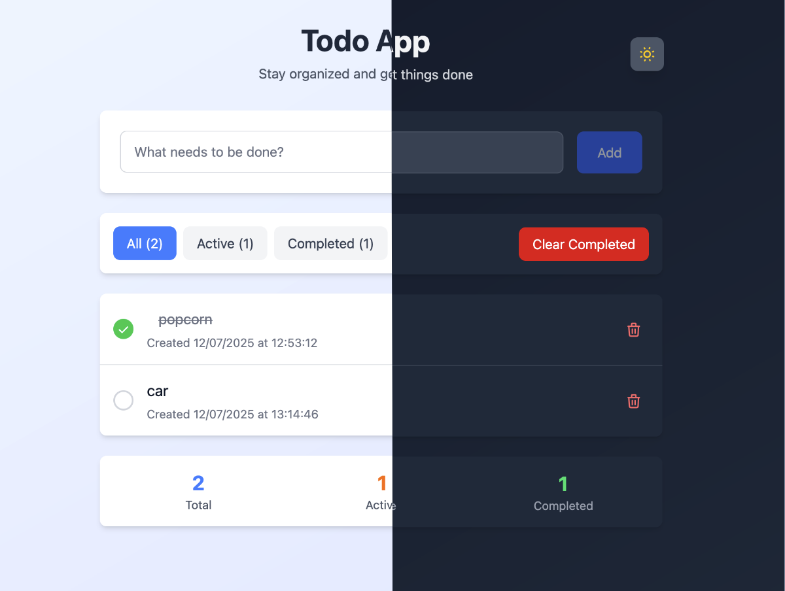

# Svelte Runes Todo App

A modern, animated todo application built with Svelte 5 (Runes), SvelteKit, and Tailwind CSS v4. Features a beautiful dark/light theme toggle, smooth animations, and internationalization support.

## 📸 Screenshot



## ✨ Features

- 🎯 **Todo Management** - Add, complete, filter, and delete todos
- 🌓 **Dark/Light Theme** - Smooth theme switching with system preference detection
- 🎨 **Beautiful Animations** - Smooth transitions and micro-interactions
- 🌍 **Internationalization** - Multi-language support (English/Portuguese) with Paraglide
- 📱 **Responsive Design** - Works perfectly on all device sizes
- ⚡ **Modern Stack** - Svelte 5 Runes, SvelteKit, Tailwind CSS v4
- 🎭 **Accessibility** - ARIA labels and keyboard navigation
- 🧪 **Testing** - Unit tests with Vitest and E2E tests with Playwright

## 🚀 Quick Start

```bash
# Clone the repository
git clone <your-repo-url>
cd svelte-runes

# Install dependencies
pnpm install

# Start development server
pnpm dev

# Open in browser
open http://localhost:5173
```

## 🛠️ Development

### Available Scripts

```bash
# Development
pnpm dev              # Start dev server
pnpm build            # Build for production
pnpm preview          # Preview production build

# Code Quality
pnpm lint             # Run linter
pnpm format           # Format code with Prettier
pnpm check            # Type check with svelte-check

# Testing
pnpm test:unit        # Run unit tests
pnpm test:e2e         # Run E2E tests
pnpm test             # Run all tests
```

### Project Structure

```text
src/
├── lib/
│   ├── components/           # Svelte components
│   │   ├── ThemeToggle.svelte   # Dark/light theme switcher
│   │   ├── TodoApp.svelte       # Main todo application
│   │   ├── TodoInput.svelte     # Todo input form
│   │   ├── TodoList.svelte      # Todo list container
│   │   ├── TodoItem.svelte      # Individual todo item
│   │   ├── TodoFilters.svelte   # Filter and actions
│   │   └── TodoStats.svelte     # Statistics display
│   ├── stores/
│   │   └── theme.ts          # Theme management store
│   ├── types/
│   │   └── todo.ts           # TypeScript types
│   └── paraglide/            # Internationalization
├── routes/
│   ├── +layout.svelte        # App layout
│   ├── +page.svelte          # Home page
│   └── demo/                 # Demo pages
├── app.css                   # Global styles & animations
└── app.html                  # HTML template
```

## 🎨 Animations & Interactions

The app features smooth, performant animations built with CSS transforms:

- **Fade In** - Components smoothly appear on load
- **Scale Effects** - Interactive elements scale on hover/focus
- **Bounce Animations** - Celebration effects for completed todos
- **Slide Transitions** - Smooth movement for dynamic content
- **Icon Animations** - Rotating sun icon and interactive moon icon

## 🌙 Theme System

The theme system uses Tailwind CSS v4's new configuration approach:

- **System Detection** - Automatically detects user's preferred color scheme
- **Local Storage** - Remembers theme preference across sessions
- **CSS Classes** - Uses `.dark` class on `<html>` element
- **Smooth Transitions** - All theme changes are animated

## 🌍 Internationalization

Built with Paraglide for type-safe i18n:

- **English** (`en`) - Default language
- **Portuguese** (`pt`) - Secondary language
- **Type Safety** - Compile-time checks for translation keys
- **Dynamic Loading** - Efficient bundle splitting per locale

## 🧪 Testing

### Unit Tests (Vitest)

```bash
pnpm test:unit
```

### E2E Tests (Playwright)

```bash
pnpm test:e2e
```

## 🏗️ Tech Stack

- **Framework** - [Svelte 5](https://svelte.dev) with Runes
- **Meta-framework** - [SvelteKit](https://kit.svelte.dev)
- **Styling** - [Tailwind CSS v4](https://tailwindcss.com)
- **Package Manager** - [pnpm](https://pnpm.io)
- **Type Checking** - [TypeScript](https://typescriptlang.org)
- **Testing** - [Vitest](https://vitest.dev) + [Playwright](https://playwright.dev)
- **Linting** - [ESLint](https://eslint.org) + [Prettier](https://prettier.io)
- **i18n** - [Paraglide](https://inlang.com/m/gerre34r/library-inlang-paraglideJs)

## 📝 License

This project is open source and available under the [MIT License](LICENSE).
